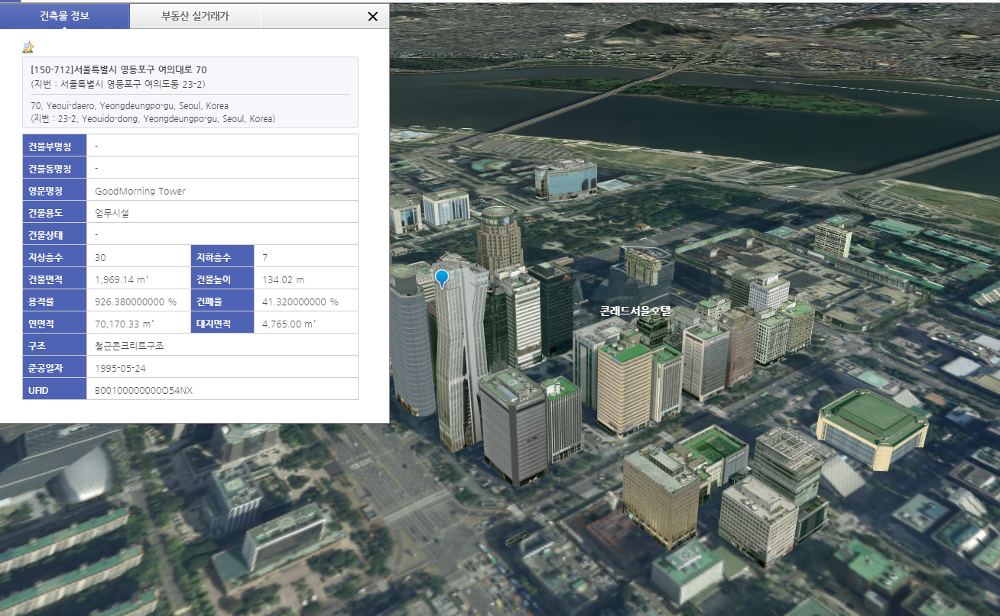
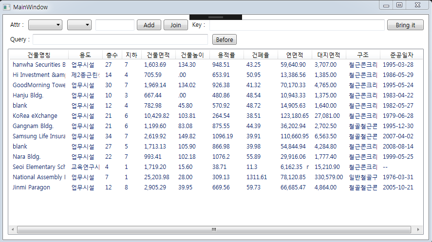
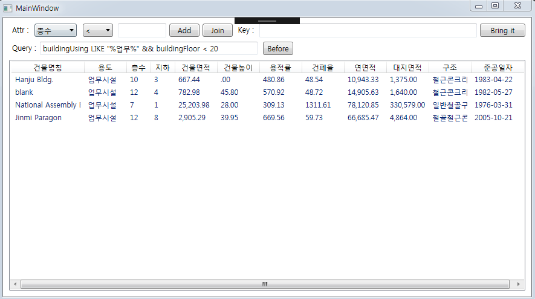

# Vworld에서 3D 건물 텍스쳐들의 정보를 가져오는 소스입니다.

## 1. 개요
-------------
 건물을 클릭하게 되면 아래와 같이 건물의 정보가 나타납니다. 웹 디버깅 툴인 피들러를 통해 HTTP 요청시 GET 방식으로 UFID를 넘겨주어 정보들은 응답받는 것을 확인하였습니다. 해당 소스는 20개의 건물 정보를 가져와서 조건에 따라 해당되는 건물들을 리스트에 보여주는 소스입니다. 
 
#### Vworld 건물 선택 화면 
 

## 2. 사용법
-------------
##### clone 해서 바로 사용하시면 됩니다.

### 2.1 기능
- 'Key' 를 적는 텍스트박스에 UFID를 적어주시고, [Bring it] 버튼을 누르게 되면 해당 UFID를 가진 건물의 정보가 리스트에 추가됩니다.
-  오른쪽 상단에 'Attr' 라는 콤보박스에서 찾으실 속성 값을 선택하시고, 옆 빈칸에 찾으실 값을 입력한 다음 Search 버튼을 누르시면 됩니다.
	- 기준 값이 수치인 경우 미만, 초과 값을 찾을 지 선택하고, 기준 값을 적습니다.  
	- 기준 값이 문자일 경우 써준 문자가 포함된 값들을 찾아냅니다.
	- [Add]는 'AND' 연산을 가리키고, [join]은 'OR' 연산을 가리킵니다.
	- Query에는 DB에 바로 사용할 수 있도록 where절의 query를 출력합니다.
- 'Before' 버튼은 이 전의 값들로 원상복귀 시켜줍니다.

### 2.2 실행 방법
- #### 처음 화면


- #### 검색 화면 (ex; 용도에서 '업무'를 포함한 List와 층수가 20 미만 되는 List의 교집합한 결과입니다.)


### 2.2 주요 함수 / 클래스
- #### htmlRequest(string ufid)
```
htmlRequest([UFID])   // UFID를 넘겨주어 HTML Body를 response로 받아 옵니다.
```
- #### HtmlParseAction(string html)
```
htmlRequest([HTML])   // HTML Body를 받아 parsing 하여 사용할 정보를 얻고, 리스트에 추가합니다.
```
- #### Data 클래스
```
 public class Data
        {
            public List<Info> link { get; set; }	// 보여지는 List 정보들
            public string str { get; set; }			// 해당 List 들을 검색한 쿼리
            public Data(List<Info> link, string str)
            {
                this.link = link;
                this.str = str;
            }
        }
```


